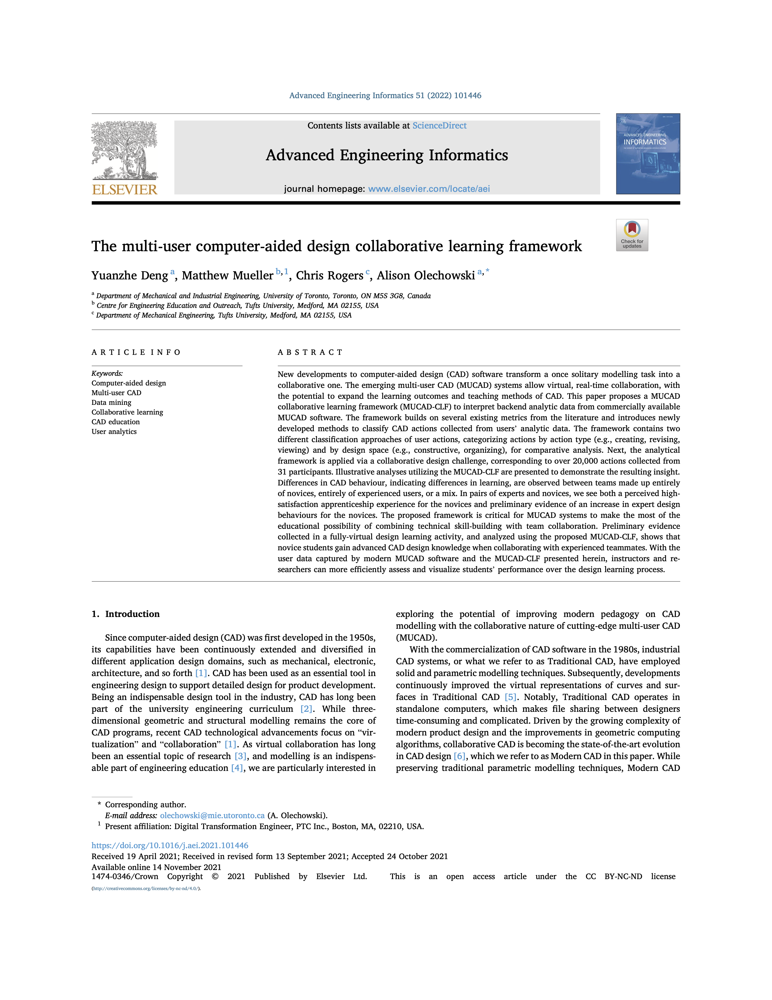

# Repository of Research Methodologies for Onshape Enterprise Analytics

<section class="section">
    

        <table>
            <thead>
                <tr>
                    <th colspan="2">Research Methologies</th>
                </tr>
            </thead>
            <tbody>
                <tr>
                    <td>
                        
                    </td>
                    <td>
                        The <b>Multi-User Computer-Aided Design Collaborative Learning Framework (MUCAD-CLF)</b> provides two classification methods to categorize CAD actions into a few categories for aggregate analysis and comparison. Click <a href='https://doi.org/10.1016/j.aei.2021.101446'>here</a> to read about the paper and <a href='https://github.com/ReadyLab-UToronto/MUCAD-CLF'>here</a> for the open-sourced code.  
                        <blockquote>
                        Deng Y, Mueller M, Rogers C, Olechowski A. The Multi-User Computer-Aided Design Collaborative Learning Framework. <i>Adv Eng Informatics</i>. 2022;51:101446. doi:10.1016/j.aei.2021.101446
                        </blockquote>
                    </td>
                </tr>
            </tbody>
        </table>
    
