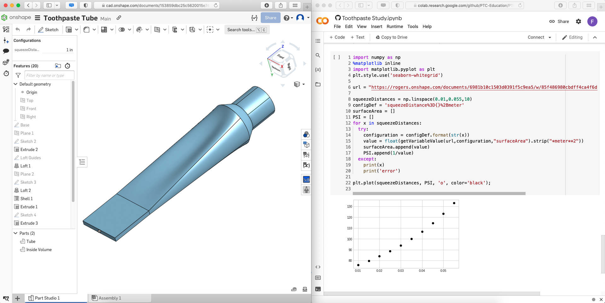
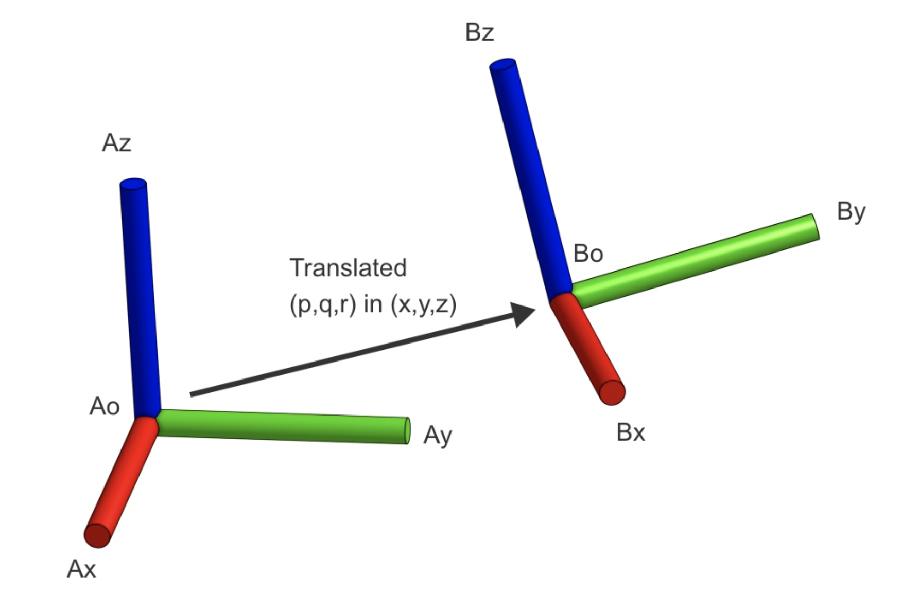
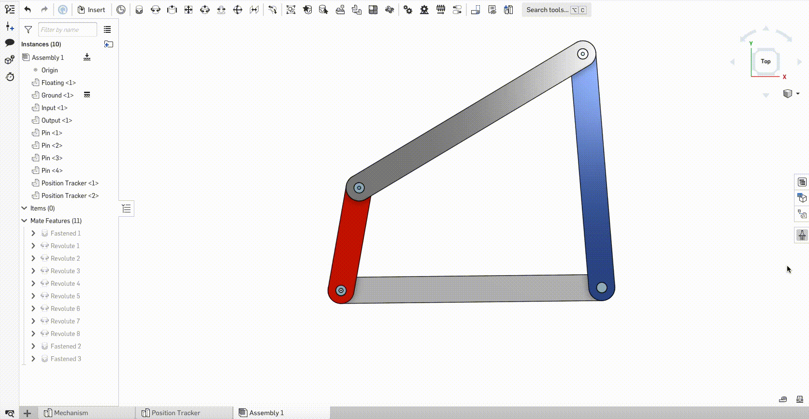
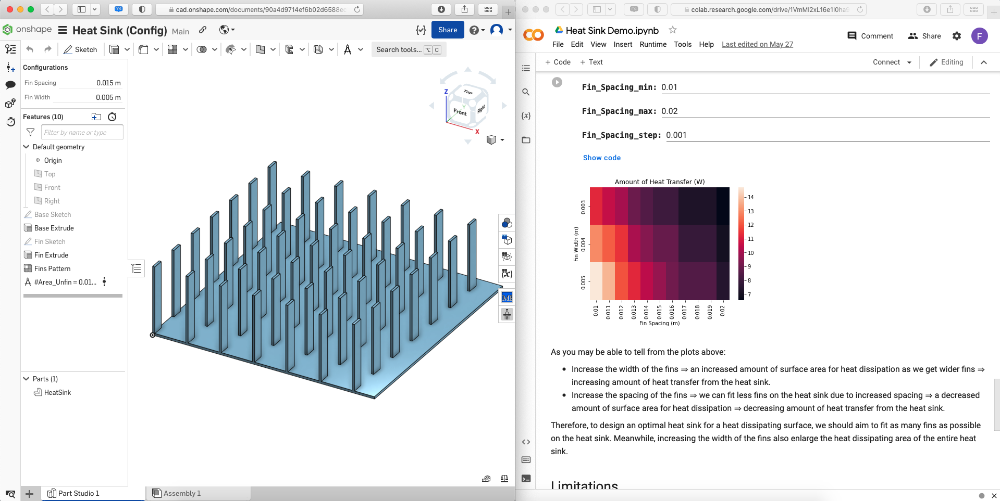

# Sample Projects Using the Onshape REST API
We are in the process of expanding on our series of examples leveraging the Onshape REST API in research applications. These will be published during August 2022.   

Most resources presented in this guide are written in Python with Jupyter notebooks, hosted on Google Colab. It is recommended to use the same programming environment for practice and learning. For other programming languages, please refer to the official [Onshape developer documentation](https://onshape-public.github.io).

<section class="section">
    

        <table>
            <thead>
                <tr>
                    <th colspan="2">Engineering Analysis</th>
                </tr>
            </thead>
            <tbody>
                <tr>
                    <td>
                        
                    </td>
                    <td>
                        The <b>toothpaste project</b> provides a great introduction to doing analysis with the Onshape REST API. After building the CAD model in Onshape, one can easily calculate the volume of an irregular structure (the toothpaste tube) to simulate the squeezing action. <a href='https://github.com/PTC-Education/PTC-API-Playground/blob/main/Toothpaste_Study.ipynb'>Click here to learn more about the project. </a>
                    </td>
                </tr>
                <tr>
                    <td>
                        
                    </td>
                    <td>
                        Translating and rotating objects with the <b>transformation matrix</b> is an important, but hard to visualize, concept in linear algebra. Building models in Onshape and running calculations in Jupyter notebooks provide additional support to the learning experience. <a href='https://github.com/PTC-Education/PTC-API-Playground/blob/main/Transformation_Matrices_Lesson_Plan.ipynb'>Click here to learn more about the project. </a>
                    </td>
                </tr>
                <tr>
                    <td>
                        
                    </td>
                    <td>
                        <b>Four-bar mechanism</b> is one of the basic but popular topic in the traditional mechanical engineering cirriculum. Specifically, varying the lengths of different linkages in the mechanism creates different motion paths for the input and output links. Making REST API calls enables simulation of the motion and kinematic analysis of the mechanism. <a href='https://github.com/PTC-Education/Four-Bar-Mechanism'>Click here to learn more about the project. </a>
                    </td>
                </tr>
                <tr>
                    <td>
                        
                    </td>
                    <td>
                        Designing and calculating the amount of heat transfer from a <b>heat sink</b> is a common component of a heat transfer course in engineering. Instead of doing repetitive calculation of the surface area of heat sinks with different shape and size, building an Onshape model of the heat sink enables large-scale analysis. <a href='https://github.com/PTC-Education/Heat-Sink-Design/blob/main/Heat_Sink_Demo.ipynb'>Click here to learn more about the project. </a>
                    </td>
                </tr>
            </tbody>
        </table>
    

</section>